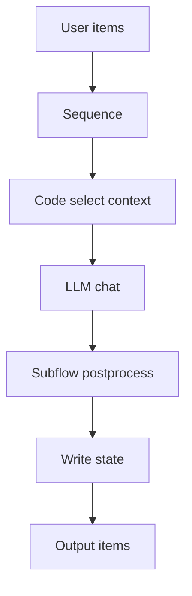

# SmartTavern - LLM 文字冒险工作流后端（n8n 粒度，IR 组合语义）

## 项目概述

SmartTavern 当前阶段目标：构建专为 LLM 文字冒险游戏设计的“后端工作流编辑器”与执行引擎。整体思路融合了 n8n 的原子节点与 items I/O 粒度，以及 SillyTavern 的上下文/提示词组织能力。前端暂不在本阶段范围内。

本次重构：
- 节点不使用硬编码，改为自动发现与配置驱动的原子化注册机制
- 工作流的中间表示（IR）为独立文档，并通过组合节点语义（Sequence / If / Subflow，后续扩展 Parallel / Loop）描述流程
- 节点 I/O 统一为 n8n 风格的 items 数组，每个 item 为结构化 dict

## 新架构一览

- 注册中心与自动发现
  - [`flow/registry.py`](flow/registry.py)
- 工作流 IR 加载/校验/索引
  - [`flow/ir.py`](flow/ir.py)
  - [`schemas/ir.schema.json`](schemas/ir.schema.json)
- 执行器（解释器）
  - [`flow/executor.py`](flow/executor.py)
- 状态管理（双态：Working / LSS + 异步 pending 回退）
  - [`flow/state_manager.py`](flow/state_manager.py)
- 原子节点库（自动扫描 flow.nodes.* 下的 Node 子类）
  - 逻辑/提示：[`flow/nodes/logic.py`](flow/nodes/logic.py)
  - LLM 调用：[`flow/nodes/llm.py`](flow/nodes/llm.py)
  - 状态：[`flow/nodes/state.py`](flow/nodes/state.py)
  - 变换：[`flow/nodes/transform.py`](flow/nodes/transform.py)
- 示例工作流与子工作流
  - 主流程：[`config/workflows/main.yaml`](config/workflows/main.yaml)
  - 子流程：[`config/workflows/subflows/postprocess.yaml`](config/workflows/subflows/postprocess.yaml)

说明：
- 原有模块（Engine/WorkflowRunner/PromptConstructor 等）已保留作为参考，但不参与新执行路径：
  - [`core/engine.py`](core/engine.py)
  - [`workflow/runner.py`](workflow/runner.py)
  - [`workflow/nodes.py`](workflow/nodes.py)
  - [`prompt_engine/constructor.py`](prompt_engine/constructor.py)
  - [`services/llm_adapter.py`](services/llm_adapter.py)

## 设计原则

- 原子化节点与非硬编码：
  - 节点实现只需继承 Node 并置于 flow.nodes 包中，注册中心自动发现（无需手动维护映射表）
- 独立 IR 与组合语义：
  - 工作流以 YAML/JSON 文档描述，统一字段：id / version / entry / nodes
  - 组合节点语义由执行器解释（Sequence / If / Subflow；后续增加 Parallel / Loop）
- n8n 粒度的 I/O：
  - 所有节点以 items[List[dict]] 为输入输出
  - 原子节点仅处理 items，不直接隐式读写全局状态；状态更新通过专职节点或 NodeContext API 显式进行

## 工作流 IR 规范

- Schema 定义：[`schemas/ir.schema.json`](schemas/ir.schema.json)
- 核心结构：
  - id: string（工作流标识）
  - version: integer（版本）
  - entry: string（入口节点 id）
  - nodes: array（节点列表）
    - node: { id, type, params?, children?, if?, subflow? }
- 已支持的组合语义（MVP）：
  - Sequence：按 children 顺序执行
  - If：条件为字符串表达式（将迁移为安全表达式），then/else 分支为节点 id 列表
  - Subflow：引用其他工作流（ref: id@version），支持 input_map/output_map 字段映射，以及 share_state（当前默认共享）
- 计划支持：
  - Parallel：并行分支执行与合并策略
  - Loop：按条件或计数循环处理 items

示例（节选，自带子工作流调用）：
```yaml
id: main
version: 1
entry: seq_main
nodes:
  - id: seq_main
    type: Sequence
    children:
      - inc_turn
      - build_context
      - call_llm
      - post_sf
      - write_state

  - id: inc_turn
    type: IncrementCounter
    params:
      field: turn_count

  - id: build_context
    type: Code
    params:
      function: select_context
      outputs: ["messages", "context_slots"]

  - id: call_llm
    type: LLMChat
    params:
      model: "narrative-llm"
      messages_from: "messages"
      response_field: "llm_response"

  - id: post_sf
    type: Subflow
    subflow:
      ref: "postprocess@1"
      input_map:
        llm_response: input_text
      output_map:
        narrative: narrative
      share_state: true

  - id: write_state
    type: WriteState
    params:
      from_item_map:
        narrative: last_narrative
```

子工作流（后处理）：
```yaml
id: postprocess
version: 1
entry: seq
nodes:
  - id: seq
    type: Sequence
    children: [normalize]

  - id: normalize
    type: Map
    params:
      set:
        narrative: input_text
```

## 节点 I/O 规范与上下文

- I/O 约定：
  - 输入：items[List[dict]]；每个 item 为可扩展字典
  - 输出：NodeResult.items[List[dict]]；返回加工后的 items
  - 节点尽量视为纯函数，不直接持久化外部状态
- NodeContext（执行上下文）：
  - 提供状态访问（Working/LSS 与 pending 回退）、资源注入（llm、插件函数）、日志等
  - 状态 API（V2）：get_working_state() / get_for_prompt() / update_state_sync() / start_async_update() / complete_async_update() / read() 等
  - 参见：[`flow/state_manager.py`](flow/state_manager.py)

## 原子节点库（MVP）

- 逻辑与模板：
  - Code（上下文/提示构建，基于白名单函数表）
    - [`flow/nodes/logic.py`](flow/nodes/logic.py)
- LLM：
  - LLMChat（统一适配器调用，写回 item 指定字段）
    - [`flow/nodes/llm.py`](flow/nodes/llm.py)
- 状态：
  - ReadState / WriteState / IncrementCounter
    - [`flow/nodes/state.py`](flow/nodes/state.py)
- 变换：
  - Map / Filter / Merge / Split（表达式基于 jmespath）
    - [`flow/nodes/transform.py`](flow/nodes/transform.py)

## 执行器与组合语义

- 执行器（解释器）：[`flow/executor.py`](flow/executor.py)
  - 解释 IR 并调度节点：Sequence / If / Subflow
  - Subflow 调用共享状态（默认），支持输入/输出字段映射
  - 计划：Parallel / Loop 语义与合并策略
- 自动发现与注册：[`flow/registry.py`](flow/registry.py)
  - 扫描 flow.nodes 包下的 Node 子类并注册类型名

流程示意：


## 快速开始

1) 安装依赖：
```bash
python -m pip install -r requirements.txt
```

2) 配置与示例工作流：
- 主流程：[`config/workflows/main.yaml`](config/workflows/main.yaml)
- 子流程：[`config/workflows/subflows/postprocess.yaml`](config/workflows/subflows/postprocess.yaml)
- 可选世界配置（初始状态）：[`config/world_config.yaml`](config/world_config.yaml)

3) 运行端到端测试：
```bash
python tests/new_flow_test.py
```
预期：
- 生成 narrative 字段并写回 last_narrative 至状态
- 日志显示节点发现、IR 加载、LLM 调用（本地无服务则回退 mock）、子工作流执行

## 后端 API

Flow API 提供以下工作流接口，供外部系统调用：
- POST /api/flow/run：执行指定 flow_id@version 与 items
- GET  /api/flow/validate：验证 IR 文档
- POST /api/flow/reload：重载 IR 目录并刷新索引

应用入口文件：
- [main.py](main.py)
- [api/endpoints.py](api/endpoints.py)

## 安全策略与合规

- Code 节点函数使用白名单表（NodeContext.resources["code_funcs"]），默认不允许任意 eval
- If 条件目前采用受限 eval，后续将替换为安全表达式（如 jmespath 或受限解析器）
- 模板与表达式渲染出错会记录日志并返回可读的错误片段

## 目录结构（重构后新增）

```
SmartTavern/
├── flow/
│   ├── node_base.py        # Node/NodeContext/NodeResult 抽象
│   ├── registry.py         # 节点注册与自动发现
│   ├── ir.py               # IR 加载/校验/索引
│   ├── executor.py         # 执行器（解释组合语义）
│   ├── state_manager.py    # 状态管理（Working/LSS + pending）
│   └── nodes/
│       ├── __init__.py
│       ├── logic.py        # Code 节点
│       ├── llm.py          # LLMChat 节点
│       ├── state.py        # ReadState / WriteState / IncrementCounter
│       └── transform.py    # Map / Filter / Merge / Split
├── schemas/
│   └── ir.schema.json      # IR JSON Schema
├── config/
│   ├── workflows/
│   │   ├── main.yaml       # 主工作流
│   │   └── subflows/
│   │       └── postprocess.yaml # 子工作流示例
│   ├── world_config.yaml   # 选用的初始世界状态（旧版结构兼容）
│   └── api_config.yaml     # LLM 服务适配器配置（沿用）
└── tests/
    └── new_flow_test.py    # 端到端测试
```

## 运行依赖

- Python 3.8+
- 主要第三方库：
  - fastapi / uvicorn（保留旧入口用）
  - pydantic / PyYAML / Jinja2 / requests
  - jsonschema（IR 校验）
  - jmespath（表达式映射与安全条件替代）

详见：[`requirements.txt`](requirements.txt)

## 路线图

- [ ] 组合控制扩展：Parallel / Loop 支持与合并策略
- [ ] 安全表达式引擎：替换 If 的 eval，统一用 jmespath 或受限解析器
- [x] Flow API 接口：run / validate / reload 与执行器对接
- [ ] 度量与日志：结构化日志、Tracing、节点耗时/吞吐指标
- [ ] 开发者指南：IR 规范、节点扩展、子工作流用法、插件白名单
- [ ] 更丰富的原子节点：缓存、持久化、外部资源拉取等

## 许可证

MIT License（与原项目一致）

## 致谢

- n8n 的原子节点与 items 模型启发
- 社区对 LLM 文本交互实践的探索
## Gemini API 使用与验证（与官方 cURL 对齐）

为确保与官方示例一致，适配器会按以下规则构造请求：
- 使用请求头传递 API Key：`x-goog-api-key: <你的API Key>`
- 内容类型：`Content-Type: application/json`
- 端点：`https://generativelanguage.googleapis.com/v1beta/models/gemini-2.5-flash:generateContent`
- 载荷结构：
  - `contents` 是一个数组，每个元素包含 `parts: [{ "text": "<你的文本>" }]`
  - 用户消息省略 `role`（与官方 cURL 保持一致）
  - 系统消息会合并为 `systemInstruction.parts[].text`（camelCase）

官方参考 cURL（与你当前配置一致）：
```bash
curl "https://generativelanguage.googleapis.com/v1beta/models/gemini-2.5-flash:generateContent" \
  -H "x-goog-api-key: $GEMINI_API_KEY" \
  -H 'Content-Type: application/json' \
  -X POST \
  -d '{
    "contents": [
      {
        "parts": [
          {
            "text": "Explain how AI works in a few words"
          }
        ]
      }
    ]
  }'
```

适配器将 OpenAI 风格的 `messages: [{role, content}]` 自动转换为上述 Gemini 格式：
- 文件位置：[`services/llm_adapter.py`](services/llm_adapter.py)
- 转换逻辑（要点说明）：
  - 用户消息：构造成 `{"parts": [{"text": content}]}`，不带 `role`
  - 助手消息：构造成 `{"role": "model", "parts": [{"text": content}]}`（可选）
  - 系统消息：合并为 `systemInstruction.parts[].text`

配置文件说明（覆盖与环境变量）
- 基础配置：[`config/api_config.yaml`](config/api_config.yaml)
  - 你当前的模型映射为：`narrative-llm: "gemini-2.5-flash"`
- 机密覆盖：[`config/api_secrets.yaml`](config/api_secrets.yaml)
  - 示例：
    ```
    password: "REPLACE_WITH_YOUR_API_KEY"
    base_url: "https://generativelanguage.googleapis.com"
    endpoint_path: "/v1beta/models/gemini-2.5-flash:generateContent"
    ```
  - 适配器使用 `x-goog-api-key` 传递 API Key（从 `password` 或 `api_key` 字段读取）
- 环境变量（优先级最高）：
  - SMARTTAVERN_LLM_PASSWORD / LLM_API_KEY / OPENAI_API_KEY / BEARER_TOKEN
  - 若设置，会覆盖文件中的 `password`

## Flow API 使用示例（后端-only）

- 启动服务：
```bash
python main.py
```

- 执行工作流（POST /api/flow/run）：
```bash
curl -X POST "http://127.0.0.1:8192/api/flow/run" \
  -H "Content-Type: application/json" \
  -d '{
    "ref": "main@1",
    "items": [{"user_input": "Explain how AI works in a few words"}]
  }'
```
- 预期返回：
  - `items[0].narrative`：由 Gemini 生成（若服务不可用，返回 mock）
  - `state_snapshot.last_narrative`：写回状态

- 其它接口：
  - `POST /api/flow/reload`：重载 IR 文档与节点注册
  - `POST /api/flow/validate`：校验 IR 文档结构（JSON Schema）
- 实现位置：[`api/endpoints.py`](api/endpoints.py)

## 测试脚本说明

- 端到端流程（包含 Code → LLM → Subflow → 写状态）：
  - 文件：[`tests/new_flow_test.py`](tests/new_flow_test.py)
  - 运行：
    ```bash
    python tests/new_flow_test.py
    ```
  - 预期：生成 `narrative` 字段，状态写回 `last_narrative`，日志中包含 Gemini 请求预览。

- Gemini 载荷与请求头格式校验（不发网络请求，模拟会话断言格式）：
  - 文件：[`tests/gemini_payload_test.py`](tests/gemini_payload_test.py)
  - 运行：
    ```bash
    python tests/gemini_payload_test.py
    ```
  - 预期：
    - 断言 `URL` 包含 `:generateContent`
    - 断言 `headers` 包含非空 `x-goog-api-key`
    - 断言 `json` 载荷包含 `contents` 数组与 `parts[].text`
    - 输出 `Gemini payload verified. Adapter returned: OK...`

## 收尾说明

- 已完成：
  - 原子化节点与自动发现（非硬编码）：[`flow/registry.py`](flow/registry.py)
  - 独立 IR + 组合语义（Sequence / If / Subflow）：[`flow/ir.py`](flow/ir.py), [`schemas/ir.schema.json`](schemas/ir.schema.json), [`flow/executor.py`](flow/executor.py)
  - n8n 粒度 I/O：所有节点输入输出统一为 `items[List[dict]]`，状态由专用节点显式管理
  - LLM 适配（Gemini 支持与 OpenAI 备选）：[`services/llm_adapter.py`](services/llm_adapter.py)
  - 主/子工作流示例：[`config/workflows/main.yaml`](config/workflows/main.yaml), [`config/workflows/subflows/postprocess.yaml`](config/workflows/subflows/postprocess.yaml)
  - Flow API 接入与应用入口集成：[`api/endpoints.py`](api/endpoints.py), [`main.py`](main.py)
  - 机密文件与忽略策略：[`config/api_secrets.yaml`](config/api_secrets.yaml), [`.gitignore`](.gitignore)

- 待扩展（路线图）：
  - Parallel / Loop 语义增强与 IR 规范同步更新
  - 安全表达式替代 If 的 `eval`（推荐 jmespath / 受限表达式引擎）
  - 结构化日志与度量（Tracing、节点耗时/吞吐、API调用指标）
  - 开发者指南与扩展文档（IR 规范、子工作流、插件白名单策略）

- 使用建议：
  - 若出现 503/权限错误，请在 Google Cloud Console 确认：
    - 已启用「Generative Language API」
    - API Key 未设置阻断性限制（域名/IP）
    - 配额与网络状态正常